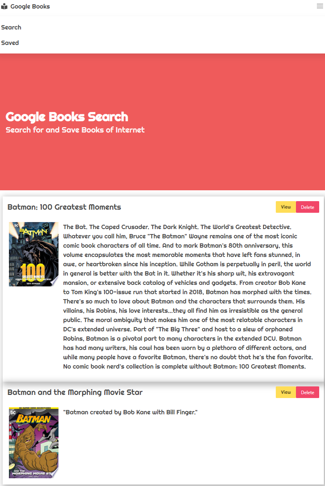

## Google Books

- [Description](#Description)
- [Installations](#Installations)
- [Licence](#Licence)
- [Contributing](#Contributing)
- [User Story](#User-Story)
- [Acceptance Criteria](#Acceptance-Criteria)
- [Test](#Test)
- [Credits](#Credits)
- [Questions](#Questions)

## Description

create a new React-based Google Books Search app. Requires create React components, work with helper/util functions, and utilize React lifecycle methods to query and display books based on user searches. You'll also use Node, Express and MongoDB so that users can save books to review or purchase later.


## Installations

clone `npm i` to run locally

## Contributing

none at this time

## User-Story

```
As a user I want to be able to search books

As a result I should be able to see title, authors, description, image and a link to buy the book

Ability to save book to buy later

And ability to remove books from saved list
```

## Acceptance-Criteria

```
Attempt to complete homework assignment as described in instructions. If unable to complete certain portions, please pseudocode these portions to describe what remains to be completed. Hosting on Heroku and adding a README.md are required for this homework. In addition, add this homework to your portfolio, more information can be found below.
```

## Licence

[](https://opensource.org/licenses/MIT)

## Test

[](https://google-books-search-and-s.herokuapp.com/)

[Live Page Here or Press Image](https://google-books-search-and-s.herokuapp.com/)

## Credits

Trilogy Teachers, TAs and staff

## Questions
email, or anyother form of contact at my portfolio
<br>
-Email: [danielsoledad@gmail.com](mailto:danielsoledad@gmail.com)
<br>
-GitHub Username: [tuzosdaniel12](https://github.com/tuzosdaniel12) 
